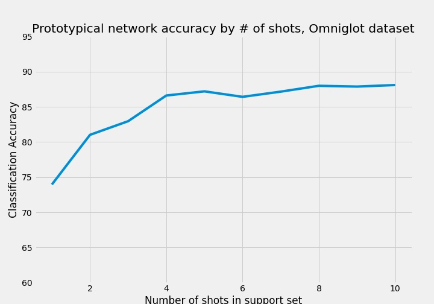
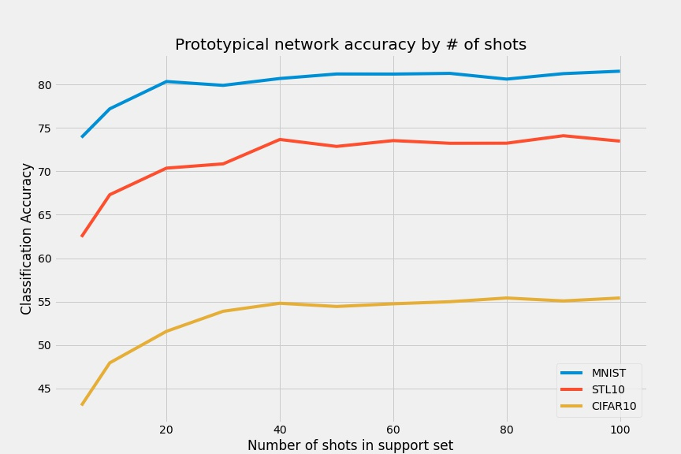

# CS 7180 Final Project: Few-Shot Visual Classification with Prototypical Networks

**Note: See [prototypical_networks.ipynb](https://github.com/cbt87/PrototypicalNetworks---CS7180-final/blob/main/prototypical_networks.ipynb) for a full description**

First, I followed a [few shot learning tutorial](https://github.com/sicara/easy-few-shot-learning/blob/master/notebooks/my_first_few_shot_classifier.ipynb) by Sicara to create a Prototypical Networks model for image classification on the Omniglot datast. 

## Original Contributions

Using the same code from the easy-few-shot-learning repo, I created a script that iterates over a range of "n-shots" between 1 and 10 in order to test how accuracy changes based on the number of support images per class for the Omniglot dataset.

Next, I wrote a function to test the effect of the number of shots on accuracy for any image dataset. The plot belows shows the change in accuracy when varying the number of shots between 5 and 100 for the MNIST, CIFAR10, and STL10 datasets. It's noteable that all three datasets hit an accuracy plateau between 20 and 40 shots.

Unfortunately, the Omniglot dataset only has 20 images per class in total, so it can not be visualized together with the other datasets. However, even in a 5-shot setting, the model is better at predicting classes for the Omniglot dataset(~86% accuracy) than it is for the other datasets when they were provided with 40 or more support images. This is perhaps not too surprising, however, given the relative simplicity of the Omniglot images compared to the CIFAR10 and STL10 images.

